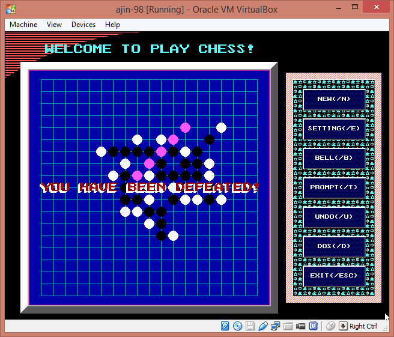
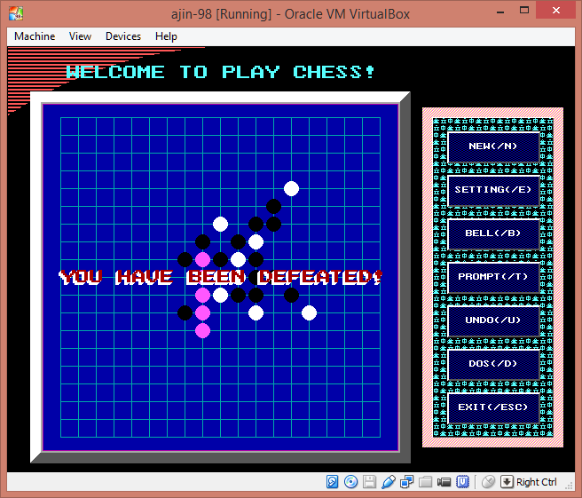
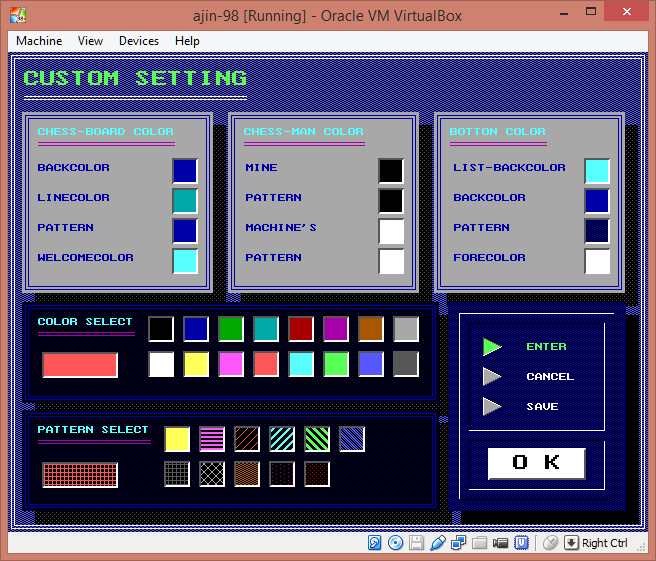

# Gobang Game

I developed this game by using **Turbo C 2.0** when I was in
university (summer, 1999). It's a **MS-DOS** program but has
beautiful Graphical User Interface and supports mouse.

## Artificial Intelligence

The artificial intelligence is very smart, which could
detect all cross cases (e.g. `3*3`, `3*4`,...). Probably
you would lose and computer would win in the first several
rounds :smile:

## Supported Platforms

The game could run on **Windows 98** and earlier only.

## Coding Style

It's a student's work. Come back to look at the code nowadays,
the coding style is very pool :thumbsdown: I did not re-format
it and keep it as is.

## Build

1. Install **Windows 98** or earlier.
2. Extract **Turbo C 2.0** tarball (`/TC2.0.zip`).
    - I added several header files to **Turbo C 2.0**. The goal
      of the new header files is to support GUI and mouse by
      calling x86 interrupt. Therefore, this tarball is an
      updated compiler.
3. Build all source files (`/src/*.c`) with the compiler.

## Screenshots

